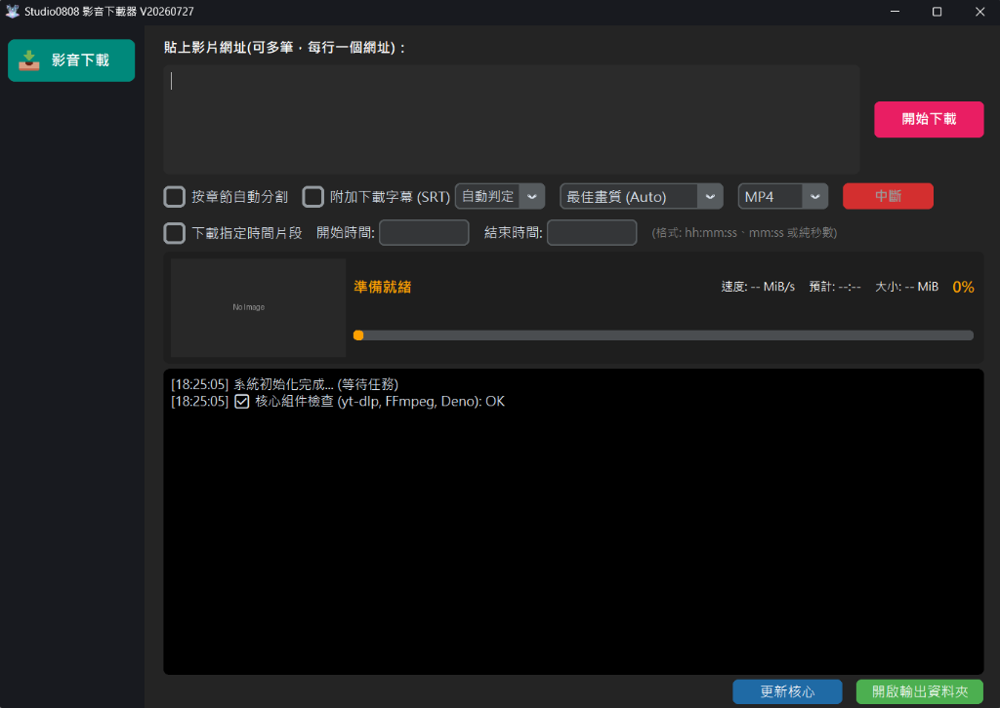

# Studio0808 全能影音下載器



[](https://github.com/begin0808/download)
[](https://www.python.org/)
[](LICENSE)

**Studio0808 全能影音下載器** 是一款基於 CustomTkinter UI、yt-dlp、FFmpeg 與 Deno JS 引擎開發的綠色免安裝影音下載與轉檔軟體。支援 YouTube、Facebook、Instagram、TikTok、Vimeo 等上百種主流影音平台。

---

## 🔥 V20260727 最新版本更新重點

- ⚡ **核心全預載 (Zero-Wait)**：預載 `yt-dlp`、`FFmpeg` 與 `Deno` 核心組件，在新電腦開箱即用、0 秒免等待下載。
- 🎬 **Facebook / IG 影音解析重構**：修復 Facebook 影片原先可能誤降級抓取純音訊 (534KB) 的問題，確保影音高畫質完整下載。
- 🛡️ **安全打包與非破壞性同步**：升級 PyInstaller 獨立暫存區打包機制，編譯時保護既有 zip 與歷史輸出紀錄。

---

## ✨ 核心功能 Highlights

- 🚀 **通用影音下載**：支援 YouTube、Facebook、Instagram、TikTok、Vimeo、Bilibili 等平台。
- 🎵 **智慧轉檔**：自動將影片轉換為 MP4, MP3, WAV, WMV, MKV, MOV 等多種常見格式。
- 📊 **播放清單與批量處理**：貼上播放清單網址，自動解析獨立影片項目供您自由勾選批量下載。
- ✂️ **按章節自動分割**：依據影片內建章節或說明欄時間軸自動裁切分類。
- ⏱️ **指定時間片段剪輯**：設定「開始時間」與「結束時間」，精準下載您需要的精華片段。
- 🔤 **外掛字幕附加下載**：支援下載官方或 AI 自動生成的繁中/簡中/英文/日文字幕 (.srt)。

---

## 🛠️ 開發與建置說明

### 依賴套件安裝
```bash
pip install -r requirements.txt
```

### 執行主程式
```bash
python Studio0808_Downloader_V20260727.py
```

### 獨立打包 EXE
```bash
python build.py
```

---

## 📄 免責聲明 (Disclaimer)

1. 本軟體僅供個人技術研究、學習與備份使用，嚴禁用於商業用途。
2. 使用者應自行遵守各平台服務條款與著作權法規，切勿散布未經授權之版權內容。
